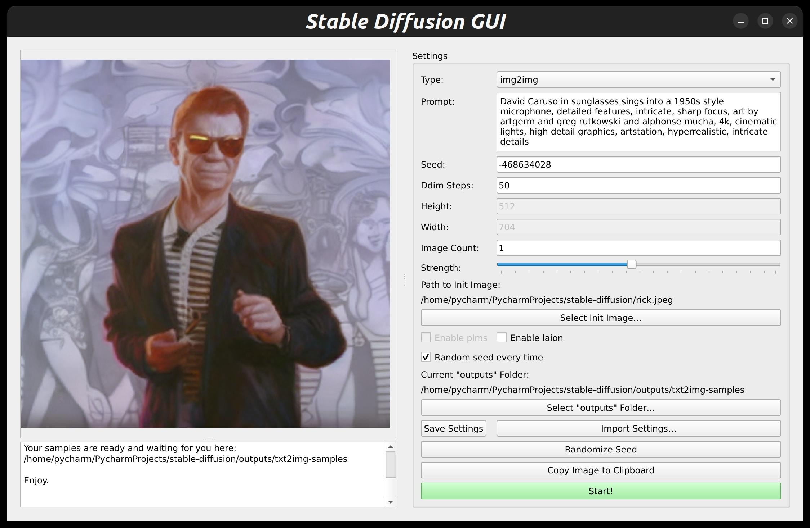

# About
This is an single-file, cross-platform (Linux, Mac, and Windows) graphical interface for [Simple Diffusion](https://github.com/CompVis/stable-diffusion).

You can set, export, and import your custom settings and copy your amazing results right to the clipboard for easy pasting.

The GUI supports both img2img and txt2img.

No web server or browser is required. The whole thing is a single python file (plus the pyqt5 package, which you can install with a single `pip` command).




## Install:
```sh
# Install requirements:
pip install pyqt5

# Move files
mv neuro-gui.py stable-diffusion/gui.py
```

## Create .exe:
```sh
# Create Executable file for windows:
cd stable-diffusion
pip install pyinstaller
pyinstaller --onefile gui.py

mv dist/gui ..
```
